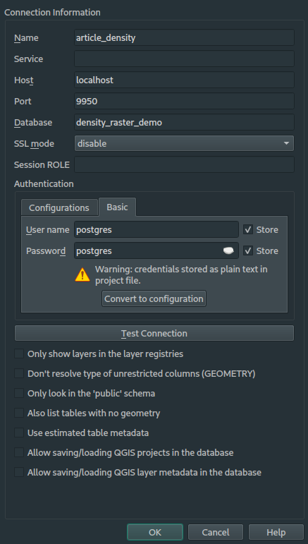

# Calcul d'un raster de densité

Ce repo contiens une stack docker-compose ainsi que les scripts SQL permettant de suivre l'article [Fabriquer un raster de densité à partir d'un nuage de points avec PostGIS](https://makina-corpus.com/sig-cartographie/fabriquer-un-raster-de-densite-partir-dun-nuage-de-points-avec-postgis).

Le dossier ./scripts est monté dans le conteneur pour pouvoir lancer les scripts SQL directement depuis le conteneur

## Lancer la stack

```
docker-compose up -d
```

## Ouvrir un shell postgres

```
docker-compose exec postgres psql -U postgres
```

## Lancer un script SQL

```
docker-compose exec postgres psql -U postgres -f /scripts/<fichier.sql>
```

## Connecter QGIS à la base de données

Suivez le paramètrage de la capture d'écran suivate :


